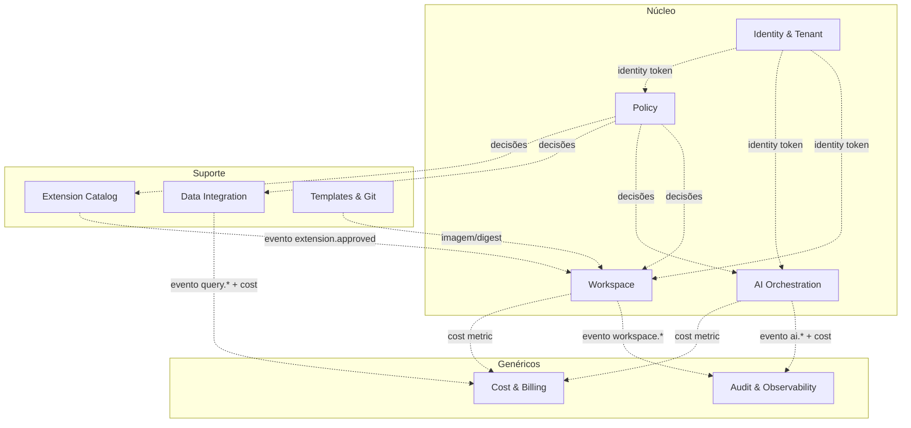

# Bounded Contexts & Modelo de Domínio

**Task:** 1.2 — Arquitetura de referência
**Versão:** 1.0.0
**Data:** 2026-04-18
**Status:** Rascunho para revisão técnica

---

## 1. Mapa de contextos

Legenda: setas tracejadas representam **integração por evento ou chamada desacoplada**; nunca acoplamento de modelo. Cada contexto possui sua linguagem ubíqua.

## 2. Contextos — responsabilidades e agregados

### 2.1 Identity & Tenant (Core)

- **Agregados:** `Tenant`, `Squad`, `User`, `Role`, `Assignment`.
- **Linguagem ubíqua:** tenant ≠ organização (um tenant pode conter várias orgs); squad é unidade de chargeback; papel é um conjunto de permissões RBAC.
- **Invariantes:** todo `User` pertence a ≥1 `Squad`; todo `Squad` pertence a exatamente 1 `Tenant`.
- **Eventos publicados:** `user.joined_squad`, `role.assigned`, `role.revoked`.

### 2.2 Workspace (Core)

- **Agregados:** `Workspace`, `Template`, `Quota`.
- **Linguagem ubíqua:** workspace = pod efêmero associado a um `User` dentro de um `Squad`; template = receita reproduzível de imagem + variáveis + quotas.
- **Invariantes:** `Workspace.quota` ≤ `Squad.quota`; template referenciado sempre por digest.
- **Eventos:** `workspace.requested`, `workspace.ready`, `workspace.terminated`.

### 2.3 Policy (Core)

- **Agregados:** `PolicySet`, `Policy`, `Decision`, `Approval`.
- **Linguagem ubíqua:** policy = regra declarativa em Rego; decision = resultado imutável com rastro.
- **Invariantes:** decisão é imutável e sempre carrega `policy_version`; `REQUIRE_APPROVAL` só é satisfeito por `Approval` de papel autorizado.
- **Eventos:** `policy.violation`, `approval.requested`, `approval.granted`.

### 2.4 AI Orchestration (Core)

- **Agregados:** `Conversation`, `PromptPolicy`, `ProviderRoute`, `CostEntry`.
- **Linguagem ubíqua:** provider é anônimo do ponto de vista do chamador; redaction é passo explícito do pipeline.
- **Invariantes:** toda request passa por Masker antes de Router; toda response gera `CostEntry`.
- **Eventos:** `ai.requested`, `ai.completed`, `ai.denied`, `ai.cost_recorded`.

### 2.5 Extension Catalog (Suporte)

- **Agregados:** `Extension`, `Version`, `ApprovalWorkflow`.
- **Linguagem ubíqua:** extensão é distinta de plugin de editor — passa por workflow corporativo; versão é imutável e assinada.
- **Invariantes:** `Version.status = Published` ⇒ existe `Approval` de perfil Sam/Rafa.
- **Eventos:** `extension.submitted`, `extension.approved`, `extension.revoked`.

### 2.6 Data Integration (Suporte)

- **Agregados:** `Connection`, `Query`, `DryRunResult`, `CostEstimate`.
- **Linguagem ubíqua:** dry-run precede execução para queries "caras"; custo estimado é decisão de negócio, não só métrica.
- **Invariantes:** `Query.execute()` exige `DryRunResult` válido quando custo > threshold da squad.
- **Eventos:** `query.dry_run_completed`, `query.executed`, `query.blocked_by_cost`.

### 2.7 Templates & Git (Suporte)

- **Agregados:** `Template`, `Repository`, `Commit`.
- **Linguagem ubíqua:** template é versionado em Git corporativo; promoção entre templates é PR.
- **Eventos:** `template.published`, `template.deprecated`.

### 2.8 Audit & Observability (Genérico)

- **Agregados:** `AuditEvent`, `Trace`, `Metric`.
- **Linguagem ubíqua:** auditoria é append-only e WORM; distinta de logs operacionais.
- **Invariantes:** `AuditEvent` nunca é alterado; retenção 7 anos (compliance).
- **Eventos consumidos:** todos os `*.violation`, `*.approved`, `ai.*`, `workspace.*`, `role.*`.

### 2.9 Cost & Billing (Genérico)

- **Agregados:** `CostEntry`, `Budget`, `ChargebackReport`.
- **Linguagem ubíqua:** custo atribuído sempre a um `Squad`; budget é janela temporal.
- **Invariantes:** toda `CostEntry` referencia um `Squad`; `ChargebackReport` é gerado a partir de agregação imutável.

## 3. Context Map — tipos de relacionamento (DDD)

| A → B | Tipo DDD | Observação |
|-------|----------|------------|
| Identity → Workspace | Upstream / Customer-Supplier | Identity define `TenantId`/`SquadId`; Workspace segue |
| Identity → AI | Customer-Supplier | Idem |
| Policy → Workspace | Shared Kernel (decision schema) | Contrato de decisão é kernel compartilhado |
| Policy → AI | Shared Kernel | Idem |
| AI → Cost | Published Language (evento `ai.completed`) | Billing não conhece AI; consome evento |
| Workspace → Cost | Published Language | Idem |
| Ext Catalog → Workspace | Anti-Corruption Layer | Workspace consome extensões sem acoplar ao modelo de aprovação |
| Templates → Workspace | Upstream / Customer-Supplier | Template é input de lifecycle |

## 4. Regras cross-context

1. **Nenhuma tabela/DB é compartilhada entre contextos.** Integração é via API ou evento.
2. **Identificadores são globais e opacos** (UUID v7 recomendado; ver ADR-0007 pendente) e sempre portam `tenant_id` no envelope, não só no payload.
3. **Published Language** das integrações por evento está documentada em [1.2-convencoes-apis.md](1.2-convencoes-apis.md) §Eventos.
4. **Cada contexto tem um owner** — ver [1.2-mapa-servicos.md](1.2-mapa-servicos.md).

## 5. Entrada para threat modeling

Contextos Core concentram risco:
- **Identity:** bypass de RBAC, token replay.
- **Policy:** policy vulnerável a race (cache stale); integridade de `policy_version`.
- **Workspace:** escalada cross-tenant via namespace; exfiltração via workspace.
- **AI:** prompt injection; vazamento via respostas logadas.

Estes pontos alimentam o STRIDE inicial em [1.2-fluxos-principais.md](1.2-fluxos-principais.md) §Riscos.
