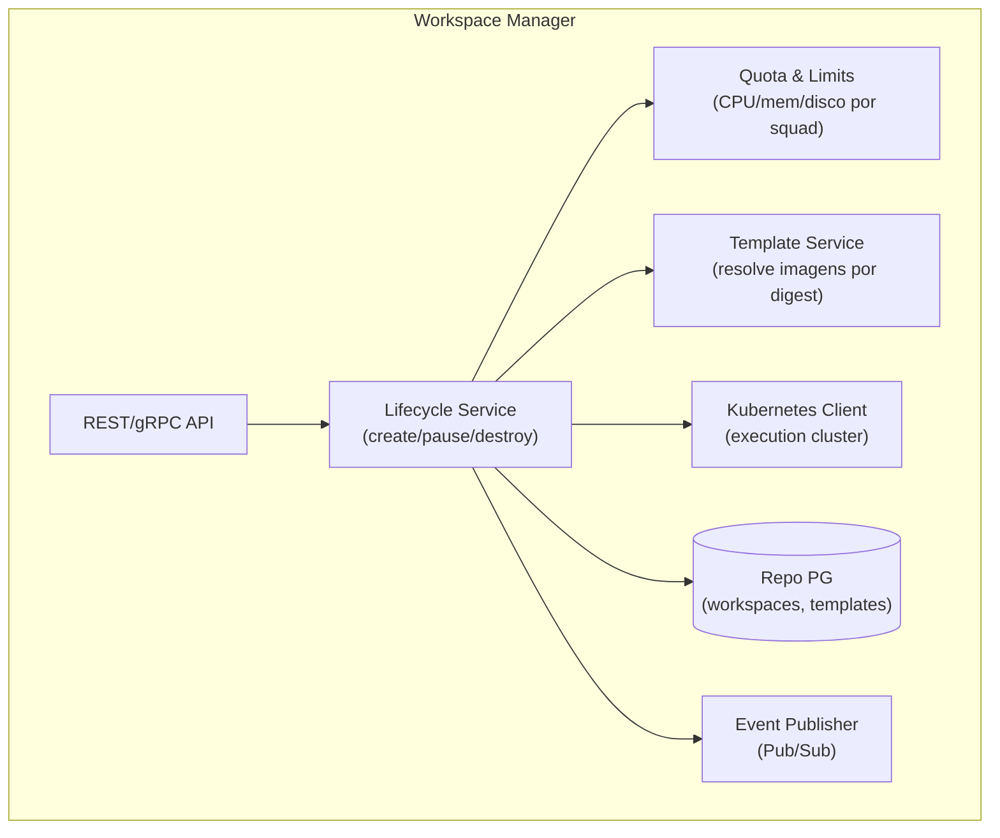
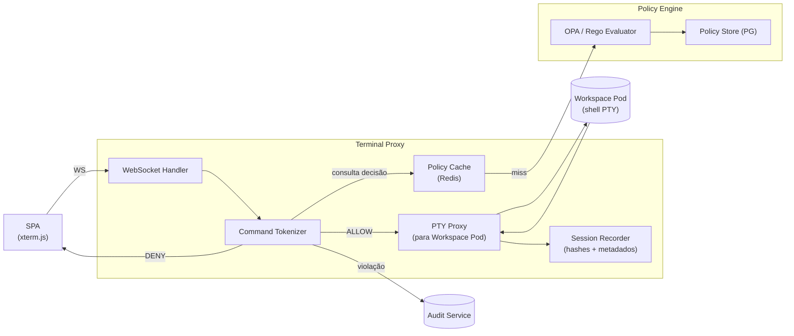
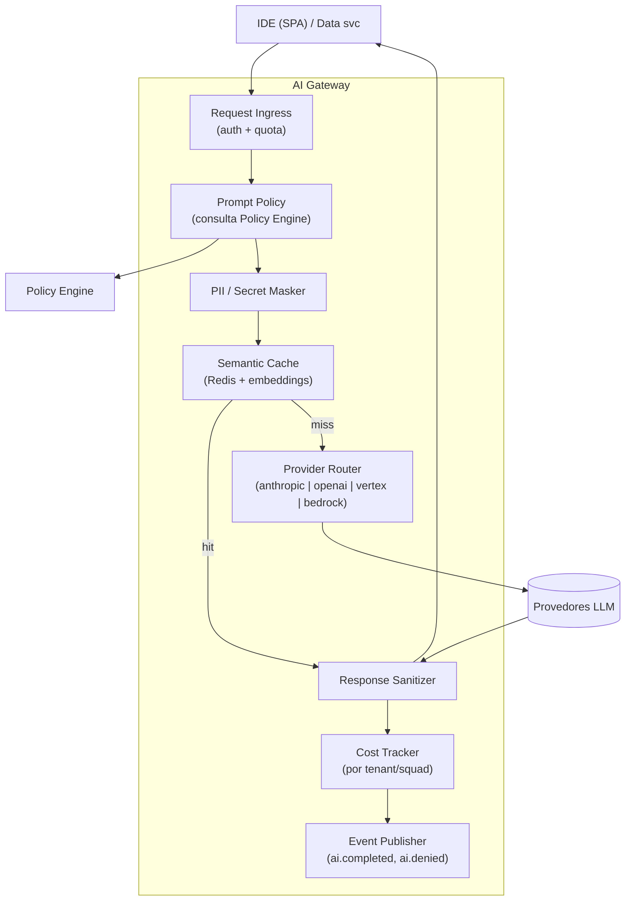

# C4 Nível 3 — Componentes

**Task:** 1.2 — Arquitetura de referência
**Versão:** 1.0.0
**Data:** 2026-04-18
**Status:** Rascunho para revisão técnica

---

## 1. Escopo

Decomposição interna dos containers com maior risco de fronteira ruim (conforme SpecDrive da task): **Workspace Manager**, **Terminal Proxy + Policy Engine**, **AI Gateway**. Os demais containers são descritos em nível suficiente para guiar squads e ficam abertos a refinamento por seus owners.

## 2. Workspace Manager



**Responsabilidades por componente**

| Componente | Responsabilidade | Interface |
|------------|------------------|-----------|
| REST/gRPC API | Entrada via API Gateway | `POST /workspaces`, `DELETE /workspaces/{id}`, `POST /workspaces/{id}/pause` |
| Lifecycle Service | Máquina de estados: `Provisioning → Ready → Paused → Terminating → Terminated` | Ver [fluxos principais](1.2-fluxos-principais.md) |
| Template Service | Resolve template → imagem (por digest), variáveis, quotas padrão | `GET /templates` |
| Quota Service | Valida cotas por squad antes de provisionar | Interno |
| Kubernetes Client | Aplica specs no cluster de execução; admission controller complementar | API K8s |
| Event Publisher | Publica `workspace.created`, `workspace.terminated` no Pub/Sub | ADR-0005 |

## 3. Terminal Proxy + Policy Engine



**Contrato Policy Engine → Terminal Proxy**

```
POST /policy/evaluate
{
  "subject":  { "user_id", "tenant_id", "squad_id", "roles": [...] },
  "action":   "terminal.exec",
  "resource": { "workspace_id", "command": "<tokenized>", "cwd" },
  "context":  { "session_id", "trace_id" }
}
→ { "decision": "ALLOW" | "DENY" | "REQUIRE_APPROVAL", "reasons": [...], "policy_id", "version" }
```

Regras críticas:
- Decisão inline **antes** de qualquer byte escrito no PTY (deny-by-default).
- `REQUIRE_APPROVAL` abre fluxo assíncrono para Rafa/Sam (task 5.2).
- Cache por `(tenant_id, command_hash, policy_version)` com TTL curto (60 s) para amortizar carga.

## 4. AI Gateway



**Propriedades obrigatórias**

- **Mascaramento antes do envio** ao provedor externo (detecção de segredos/PII com regex + dicionários; evolução: classificador). Regra herdada da visão (task 1.1).
- **Provider-agnostic** via interface `LLMProvider { complete, embed, stream }` — ADR-0002.
- **Cost tracking** em unidades normalizadas (tokens in/out × preço tabelado); evento `ai.completed` publicado para chargeback.
- **Sem lock-in** — nenhuma estrutura específica de provedor exposta ao chamador.
- **Rate limit** hierárquico: tenant → squad → user.

## 5. Demais containers — componentes em nível de resumo

| Container | Componentes principais | Pontos de interface |
|-----------|------------------------|---------------------|
| **Identity Service** | OIDC Client, Session Store (Redis), RBAC Evaluator, Claims Mapper | `GET /me`, middleware JWT |
| **Extension Catalog** | Catalog API, Review Workflow, Signature Verifier, Registry Adapter (ADR-0003) | `GET /extensions`, `POST /extensions/{id}/approve` |
| **Data Integrations** | BQ Adapter (com cost estimator), Databricks Adapter, dbt Adapter, Schema Preview | `POST /queries/dry-run`, `POST /queries/execute` |
| **Audit Service** | Event Consumer (Pub/Sub), Append-only Writer, Exporter | Consumer-side; `GET /audit/export` |
| **Web IDE Shell (SPA)** | Workbench, Command Palette, Editor (Monaco), Terminal (xterm.js), AI Panel, Extensions Panel, Data Explorer | Cliente das APIs acima |

## 6. Próximo nível

Componentes internos a cada serviço (classes/módulos) são escopo das tasks dos respectivos épicos e não entram em 1.2. Fluxos end-to-end que atravessam estes componentes estão em [1.2-fluxos-principais.md](1.2-fluxos-principais.md).
