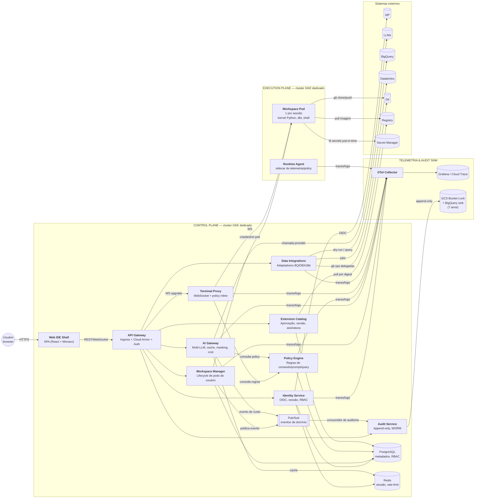

# C4 Nível 2 — Containers

**Task:** 1.2 — Arquitetura de referência
**Versão:** 1.0.0
**Data:** 2026-04-18
**Status:** Rascunho para revisão técnica

---

## 1. Visão geral

O sistema é decomposto em **control plane** (orquestração, identidade, policy, catálogos) e **execution plane** (onde código do usuário roda). Um terceiro bloco — **plano de dados de telemetria** — carrega traces, logs e auditoria. A separação é regra arquitetural inegociável (ADR-0001).

## 2. Diagrama (C4-L2)

## 3. Containers — detalhamento

| Container | Stack alvo | Responsabilidade principal | Entra/sai | Regra crítica |
|-----------|------------|-----------------------------|-----------|---------------|
| **Web IDE Shell (SPA)** | React + TypeScript + Monaco/Code-OSS (ADR-0004) | UI da IDE, command palette, editor, painel de extensões | REST + WebSocket para API Gateway | Nunca fala direto com execution plane |
| **API Gateway** | GKE Ingress + Envoy + Cloud Armor | Terminação TLS, auth, rate limit, roteamento, WAF | Entrada única do control plane | Exige JWT válido de sessão em todas as rotas exceto `/auth/*` |
| **Identity Service** | Go/Node | OIDC callback, gestão de sessão, RBAC por tenant/squad/papel | Integra com IdP; expõe contexto de identidade | Sem credenciais locais no MVP (regra da task 1.1) |
| **Workspace Manager** | Go | Lifecycle de pods de workspace (criar, pausar, destruir), quotas, templates | Fala com API do Kubernetes do execution plane | Nunca executa código do usuário; só orquestra |
| **Terminal Proxy** | Go | Proxy WebSocket entre SPA e shell do pod; aplica Policy Engine inline sobre cada comando | SPA ↔ Workspace Pod | **Deny-by-default** (regra da visão) |
| **Policy Engine** | OPA/Rego embutido como serviço Go | Avalia regras para comandos de terminal, prompts de IA, queries e instalação de extensões | Consumido por Terminal Proxy, AI Gateway, Data, Ext | Fonte única de verdade de políticas |
| **AI Gateway** | Node/Go | Orquestra chamadas multi-LLM, cache semântico, mascaramento, cost tracking, rate limit por squad | Exposto via API Gateway; integra com provedores LLM | **Mascaramento ANTES do envio** ao provedor (regra da visão); ADR-0002 |
| **Extension Catalog** | Go/Node | CRUD de extensões, workflow de aprovação, assinatura, versionamento | Ext Registry abstrato (ADR-0003) | Nada é instalável sem aprovação (workflow Rafa + Sam) |
| **Data Integrations** | Python/Go | Adaptadores para BigQuery (dry-run, custo), Databricks, dbt | Expostos via API Gateway | Cost guardrails obrigatórios antes de `query()` |
| **Audit Service** | Go | Persistência append-only de eventos sensíveis; exports; WORM | Consome do Pub/Sub; escreve em Bucket Lock | Imutabilidade garantida pelo storage (GCS Bucket Lock) |
| **Workspace Pod** | Imagem base assinada (Python, dbt, shell) | Executa código do usuário em isolamento | Puxa segredos JIT, faz git/BQ/DBX | NetworkPolicy restritiva; egress allow-list |
| **Runtime Agent** | Go sidecar | Telemetria, captura de comandos, enforcement local, heartbeats | OTel collector | Roda como sidecar para evitar acoplamento com código do usuário |
| **PostgreSQL** | Cloud SQL PG 16 HA | Metadados: tenants, squads, users, workspaces, extensões, policies | — | CMEK + backup diário |
| **Redis** | Memorystore | Cache de sessão, rate-limit counters, cache semântico do AI Gateway | — | TTL curto; sem dados sensíveis em claro |
| **Pub/Sub** | GCP Pub/Sub | Barramento de eventos de domínio (workspace.created, ai.completed, policy.violation, etc.) | — | Tópicos por domínio; ADR-0005 |
| **OTel Collector** | OpenTelemetry | Coleta unificada de traces/logs/métricas | Sinks Grafana/Cloud Trace/Logging | ADR-0006 |
| **Audit Store** | GCS Bucket Lock + BigQuery sink | Trilha imutável de auditoria, retenção 7 anos | — | Bucket Lock com retention policy bloqueada |

## 4. Fronteiras críticas

- **Control ↔ Execution:** só dois canais atravessam:
  1. **Workspace Manager → Kubernetes API do execution plane** (plano de controle).
  2. **Terminal Proxy → Workspace Pod via WebSocket** (plano de dados do usuário, passando por Policy Engine inline).
- **Nenhum serviço do control plane executa código do usuário.** Violações desta fronteira são bloqueadas por review arquitetural e threat modeling (§5).
- **Egress do execution plane** é restrito por allow-list (BigQuery, Databricks, Git, Registry, Secret Manager, LLMs apenas via AI Gateway do control plane).

## 5. Riscos de fronteira (entrada para threat modeling)

| Fronteira | Risco | Mitigação inicial |
|-----------|-------|-------------------|
| Terminal Proxy ↔ Workspace Pod | Comando malicioso bypassando Policy Engine | Policy inline síncrona antes do write no PTY; testes adversariais |
| AI Gateway ↔ LLM externo | Vazamento de PII ou segredo via prompt | Mascaramento obrigatório pré-envio; redaction de respostas logadas |
| Workspace Pod ↔ BigQuery | Query de alto custo não autorizada | Dry-run obrigatório + aprovação acima de threshold (task 9.1) |
| Workspace Manager ↔ Kubernetes | Escalada de privilégio via spec adulterado | Admission controller + PodSecurityStandard `restricted` |
| Extension Catalog ↔ Registry | Imagem não assinada/corrompida | Exigir assinatura Sigstore/cosign; referência por digest |

## 6. Próximo nível

Ver [1.2-c4-componentes.md](1.2-c4-componentes.md) — componentes internos por container.
