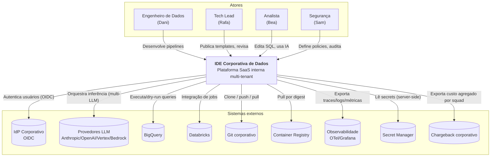

# C4 Nível 1 — Diagrama de Contexto

**Task:** 1.2 — Arquitetura de referência
**Versão:** 1.0.0
**Data:** 2026-04-18
**Status:** Rascunho para revisão técnica

---

## 1. Objetivo

Mostrar o sistema **IDE Corporativa de Dados** como uma caixa única, seus usuários e os sistemas externos com os quais interage. Serve de ponto de partida para todos os times e para o threat modeling inicial.

## 2. Atores

| Ator | Persona (task 1.1) | Canal |
|------|--------------------|-------|
| Engenheiro(a) de Dados | Dani | Browser (SPA) |
| Tech Lead / Arquiteto(a) | Rafa | Browser (SPA) + APIs admin |
| Analista / Analytics Engineer | Bea | Browser (SPA) |
| Segurança / Plataforma | Sam | Browser (painel admin) + exports de auditoria |
| Operador da plataforma | — | CLI/IaC + dashboards Grafana |

## 3. Sistemas externos

| Sistema | Papel | Integração |
|---------|-------|------------|
| **Provedor IdP corporativo** (Okta/Azure AD/Google Workspace) | Autenticação SSO/OIDC | OIDC (Authorization Code + PKCE) |
| **Provedores de LLM** (Anthropic, OpenAI, Vertex AI, Bedrock) | Inferência de IA | HTTPS server-to-server via AI Gateway |
| **BigQuery** | Data warehouse corporativo | REST/gRPC via service account por tenant |
| **Databricks** (Fase 2 completo, integração mínima no MVP) | Data lakehouse externo | REST API + OAuth M2M |
| **dbt Cloud / Dataform** | Transformações | Git + APIs |
| **Provedor Git corporativo** (GitHub/GitLab/Bitbucket) | Código-fonte | HTTPS + SSH via workspace |
| **Container Registry** (Artifact Registry + abstração multi-registry) | Imagens base de workspace e extensões | Pull por digest |
| **Object Storage** (GCS) | Artefatos, audit logs imutáveis | API nativa |
| **Serviço de Observabilidade** (Cloud Logging, Cloud Trace, Grafana) | Logs/traces/métricas | OTLP + sinks nativos |
| **Serviço de Secrets** (GCP Secret Manager) | Credenciais e chaves | API nativa |
| **Sistema de faturamento/chargeback corporativo** | Atribuição de custo por squad | Export periódico de telemetria agregada |

## 4. Diagrama (C4-L1)

## 5. Restrições de contexto

- **Multi-tenant lógico:** cada tenant enxerga somente seus próprios dados, workspaces e auditoria.
- **Dados sensíveis não persistem em provedores de LLM externos** — mascaramento ocorre no AI Gateway, antes do envio.
- **Toda entrada humana passa pelo control plane** (web) — não há cliente pesado que fale direto com execução.
- **Sistemas externos são abstraídos** — BigQuery/Databricks, LLMs e registries têm adaptadores; regras de lock-in proibido (ADR-0002, ADR-0003).

## 6. Próximo nível

Ver [1.2-c4-containers.md](1.2-c4-containers.md) — decomposição da caixa única em containers de control plane e execution plane.
