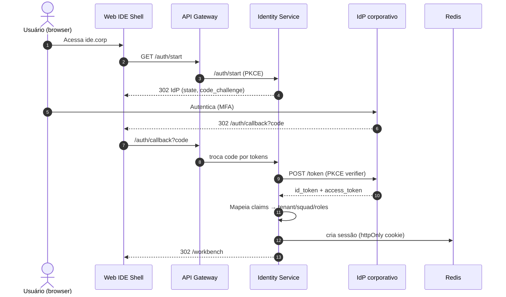
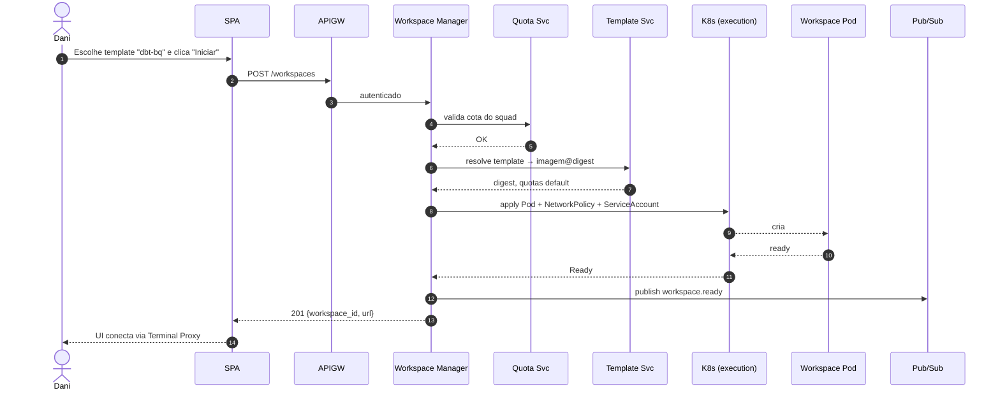
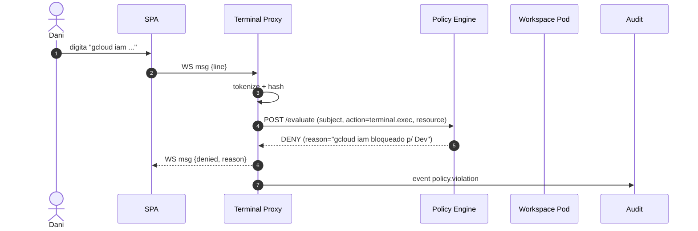
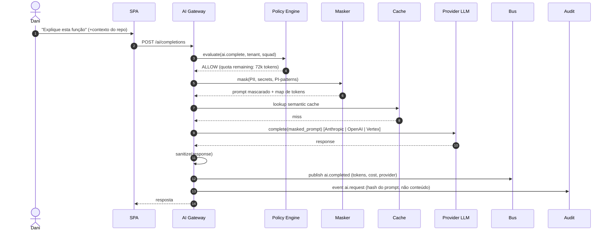
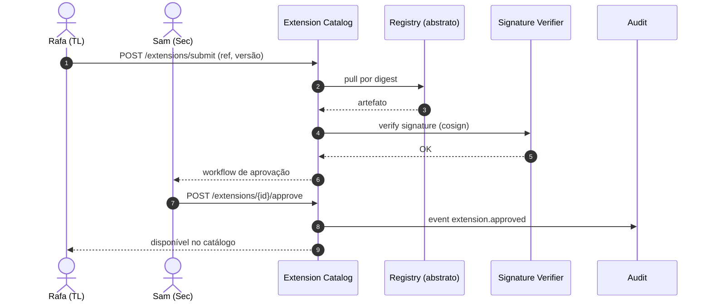

# Fluxos Principais

**Task:** 1.2 — Arquitetura de referência
**Versão:** 1.0.0
**Data:** 2026-04-18
**Status:** Rascunho para revisão técnica + threat modeling inicial

---

## 1. Login corporativo (OIDC)



**Pontos de observabilidade:** `auth.callback.latency`, `auth.failure.rate`, `claim_mapping.errors`.
**Auditoria:** `login.succeeded`, `login.failed`.

## 2. Provisionamento de Workspace



**SLO:** p95 < 3 min (conforme task 1.1 §5.2).
**Auditoria:** `workspace.ready`, `workspace.terminated`.

## 3. Execução de comando no terminal (policy inline)



**Regra:** nenhum byte atinge o PTY do pod antes da decisão ALLOW.
**Fallback:** se Policy Engine indisponível > 500ms → **DENY** (fail-closed).

## 4. Prompt de IA governado



**Invariante crítica:** o prompt enviado ao provedor é sempre o **mascarado**. O conteúdo original nunca deixa o control plane em claro.
**Cost:** evento `ai.completed` é a única fonte de verdade para chargeback.

## 5. Query BigQuery com guardrail de custo

```mermaid
sequenceDiagram
    autonumber
    actor U as Bea
    participant SPA
    participant D as Data Integrations
    participant PE as Policy Engine
    participant BQ as BigQuery
    participant AU as Audit

    U->>SPA: Executa query SQL
    SPA->>D: POST /queries/dry-run
    D->>BQ: jobs.insert (dryRun=true)
    BQ-->>D: bytesProcessed
    D->>PE: evaluate(query.execute, cost=estimated)
    alt custo ≤ threshold squad
      PE-->>D: ALLOW
      D->>BQ: jobs.insert (dryRun=false)
      BQ-->>D: jobId, resultados
      D-->>SPA: preview
    else custo > threshold
      PE-->>D: REQUIRE_APPROVAL
      D->>AU: event query.requires_approval
      D-->>SPA: bloqueado; workflow de aprovação
    end
```

**Regra:** nenhuma execução real sem dry-run prévio quando políticas de custo estão ativas.

## 6. Instalação de extensão corporativa



## 7. Checklist de viabilidade (DoD da task 1.2)

- [x] C4 L1 publicado — [1.2-c4-contexto.md](1.2-c4-contexto.md)
- [x] C4 L2 publicado — [1.2-c4-containers.md](1.2-c4-containers.md)
- [x] C4 L3 publicado — [1.2-c4-componentes.md](1.2-c4-componentes.md)
- [x] Bounded contexts definidos — [1.2-bounded-contexts.md](1.2-bounded-contexts.md)
- [x] Fluxos principais descritos — este documento
- [x] Mapa de serviços — [1.2-mapa-servicos.md](1.2-mapa-servicos.md)
- [x] Convenções de API/eventos/telemetria — [1.2-convencoes-apis.md](1.2-convencoes-apis.md)
- [x] ADRs registrados — [adr/](adr/)
- [ ] Review técnico com tech leads (agendar)
- [ ] Threat modeling inicial (§8)

## 8. Threat modeling inicial (STRIDE, resumo)

| Fluxo | Ameaça (STRIDE) | Mitigação |
|-------|-----------------|-----------|
| 1 (login) | **S** spoofing de sessão | PKCE + cookie `HttpOnly; Secure; SameSite=Lax`; TTL curto |
| 1 | **R** repúdio de ações | Evento `login.succeeded` imutável no Audit |
| 2 (workspace) | **E** elevação via spec K8s | Admission controller + PodSecurityStandard `restricted` |
| 2 | **I** vazamento via volume | Volumes efêmeros, sem PV compartilhado entre tenants |
| 3 (terminal) | **T** tampering no canal | TLS obrigatório; WS autenticado com token de sessão |
| 3 | **E** bypass de policy | Fail-closed; decisão síncrona antes do PTY write |
| 4 (IA) | **I** vazamento de PII | Masking pré-envio; redaction de logs; sem logging do prompt bruto |
| 4 | **D** DoS via custo | Rate limit hierárquico; quota por squad; circuit breaker por provider |
| 5 (BigQuery) | **D** custo descontrolado | Dry-run obrigatório + threshold por squad |
| 6 (extensão) | **T** supply chain | Pull por digest; verificação de assinatura (cosign); SBOM |

Threat modeling detalhado será registrado em `docs/security/threat-model-v0.md` como entregável complementar.
