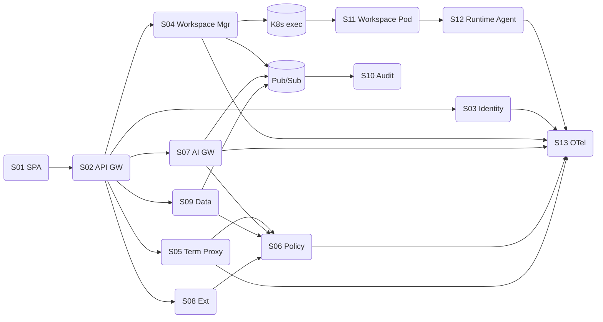

# Mapa de Serviços

**Task:** 1.2 — Arquitetura de referência
**Versão:** 1.0.0
**Data:** 2026-04-18
**Status:** Rascunho para revisão técnica

---

## 1. Catálogo

| # | Serviço | Plano | Bounded Context | Owner (squad) | Stack alvo | SLO principal | Dependências internas | Dependências externas |
|---|---------|-------|------------------|---------------|------------|----------------|-----------------------|-----------------------|
| S01 | Web IDE Shell (SPA) | Control | — (UI) | Squad IDE-UX | React/TS + Monaco | FCP < 2s p75 | API Gateway | — |
| S02 | API Gateway | Control | Cross-cutting | Squad Platform | Envoy + Cloud Armor | Disponibilidade ≥ 99.9% | Todos os services | Cloud Armor |
| S03 | Identity Service | Control | Identity & Tenant | Squad Identity | Go | Callback p95 < 400ms | PG, Redis | IdP corporativo |
| S04 | Workspace Manager | Control | Workspace | Squad Workspaces | Go | Provisionamento p95 < 3 min | PG, Pub/Sub | K8s (exec) |
| S05 | Terminal Proxy | Control | Workspace + Policy | Squad Workspaces | Go | Latência inline < 80ms p95 | Policy Engine, Redis | — |
| S06 | Policy Engine | Control | Policy | Squad SecPlat | Go + OPA/Rego | `/evaluate` p95 < 30ms | PG | — |
| S07 | AI Gateway | Control | AI Orchestration | Squad AI Platform | Node/Go | `/completions` TTFB p95 < 2s | Policy, Redis, Pub/Sub | Anthropic, OpenAI, Vertex, Bedrock |
| S08 | Extension Catalog | Control | Extensions | Squad DX | Go | — | PG, Registry | Artifact Registry |
| S09 | Data Integrations | Control | Data Integration | Squad DataConnect | Python/Go | Dry-run p95 < 1s | Policy, Pub/Sub | BigQuery, Databricks, dbt |
| S10 | Audit Service | Control | Audit | Squad SecPlat | Go | Write durability 100% | Pub/Sub consumer, GCS | — |
| S11 | Workspace Pod | Execution | Workspace (consumidor) | — (efêmero) | Imagem base assinada | — | — | BigQuery, Databricks, Git, Registry, Secret Manager |
| S12 | Runtime Agent | Execution | Observability | Squad SecPlat | Go sidecar | — | OTel Collector | — |
| S13 | OTel Collector | Telemetria | Observability | Squad SRE | OpenTelemetry | Loss < 0.1% | Grafana, Cloud Trace/Logging | — |

## 2. RACI simplificado por serviço

| Serviço | Responsible | Accountable | Consulted | Informed |
|---------|-------------|-------------|-----------|----------|
| Identity | Squad Identity | Tech Lead Identity | Security, Compliance | Todos os squads |
| Workspace Manager | Squad Workspaces | TL Workspaces | SRE, Security | IDE-UX |
| Terminal Proxy | Squad Workspaces | TL Workspaces | SecPlat | — |
| Policy Engine | SecPlat | CISO deleg. | Todos | Todos |
| AI Gateway | AI Platform | TL AI Platform | Security, FinOps, Legal | Todos |
| Extension Catalog | DX | TL DX | SecPlat | Todos |
| Data Integrations | DataConnect | TL DataConnect | FinOps, Security | IDE-UX |
| Audit | SecPlat | CISO | Compliance | Todos |

## 3. Dependências críticas (grafo)

## 4. Critérios para novos serviços

Um novo serviço só é criado se atender **todos**:

1. Pertence a um bounded context existente ou justifica um novo com ADR.
2. Tem owner (squad) e SLO definidos.
3. Expõe contrato conforme [1.2-convencoes-apis.md](1.2-convencoes-apis.md).
4. Emite telemetria OTel (ADR-0006).
5. Participa do barramento de eventos quando publica fatos de domínio (ADR-0005).
6. Respeita a separação control/execution plane (ADR-0001).

## 5. Itens em aberto

- **Owners finais** de cada squad dependem da task 13.1 (plano de delivery).
- **SLOs** são alvos de baseline; refinar após observação em staging.
- Serviço de **Billing/Chargeback dedicado** está fora do MVP; agregação inicial será feita a partir dos eventos do Pub/Sub em um job batch (ADR futuro).
